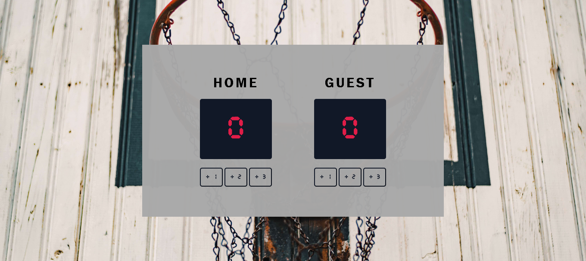

## Table of contents

- [Overview](#overview)
  - [The challenge](#the-challenge)
  - [Screenshot](#screenshot)
  - [Links](#links)
- [My process](#my-process)
  - [Built with](#built-with)
- [Author](#author)

### Overview

- From
- Scrimba : [Build a Basketball Scoreboard](https://scrimba.com/playlist/p5vWxtd)
  -Learn the basics of JavaScript by solving 140+ interactive coding challenges and building three fun projects.
- Project 2

### The challenge

- Build simple basketball scoreBoard (Home and Guest scores)
- buttons INCREMENT by one, two and three

### Screenshot

### Links

- Solution URL: [Solution URL](https://github.com/engsofjvolfe/scoreboard)
- Live Site URL: [Live site URL](https://jvolfe-basket-scoreboard.netlify.app/)

## My process

### Built with

- Semantic HTML5 markup
- CSS custom properties
- Flexbox
- CSS
- Mobile-first workflow
- JavaScript
- DOM

### What I learned

- script tag
- variable
- numbers
- console.log()
- functions
- The DOM
- getElementById()
- innerText
- textContent

### Continued development

## Author

- Git Hub - [@engsofjvolfe](https://github.com/engsofjvolfe)
- Frontend Mentor - [@engsofjvolfe](https://www.frontendmentor.io/profile/engsofjvolfe)
- LinkedIn - [@jeanco-volfe](https://www.linkedin.com/in/jeanco-volfe/)
<!-- - Instagram - [@jeanco_volfe](https://www.instagram.com/jeanco_volfe/) -->
